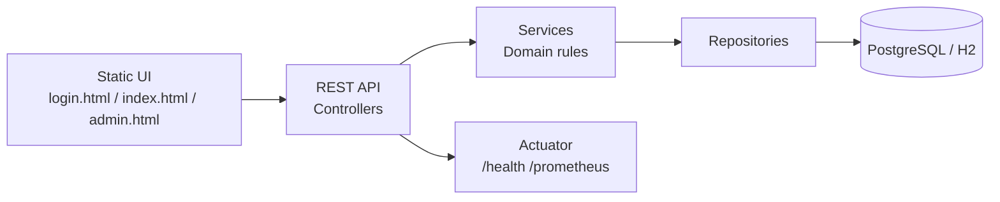

# SDD (Software Design Document) – reservationCamps

Verze: 1.0  
Datum: 2026-04-12  
Repo: `reservationCamps`

## 1. Cíle návrhu
- Jednoduchá, vrstvená architektura vhodná pro TDD (separace domény od infrastruktury).
- Verifikovatelná business pravidla na serveru (nezávisle na UI).
- Reprodukovatelné build/test v CI a snadné spuštění lokálně.
- Připravenost na kontejnerizaci a nasazení do Kubernetes.

## 2. Architektura systému

### 2.1 Přehled (komponenty)
- **Web/API**: Spring Boot REST controllery + statické HTML stránky (`/login`, `/app`, `/admin`).
- **Aplikační logika**: services (`UserService`, `CampService`, `ReservationService`).
- **Perzistence**: JPA entity + Spring Data repositories + Flyway migrace.
- **Observabilita**: Spring Boot Actuator + Prometheus endpoint.
- **CI/CD**: GitHub Actions (build/test/coverage, build&push Docker image, deploy do kind/staging + smoke test).

### 2.2 Diagram (logická architektura)

### 2.3 Vrstvy v kódu (mapování)
- API vrstva: `src/main/java/.../api`
- DTO: `src/main/java/.../api/dto`
- Service vrstva: `src/main/java/.../service`
- Doména: `src/main/java/.../domain`
- Repositories: `src/main/java/.../domain/repo`
- Migrace: `src/main/resources/db/migration` (+ `db/migration/h2` pro profil `local`)
- UI: `src/main/resources/static`

## 3. Doménový model a datový návrh

### 3.1 Entity a vztahy
- `AppUser (1) --- (N) Reservation`
- `Camp (1) --- (N) CampSession`
- `CampSession (1) --- (N) Reservation`

Entity (zjednodušeně):
- `AppUser(id, email, passwordHash, role, createdAt)`
- `Camp(id, name, basePriceCents, createdAt)`
- `CampSession(id, camp, startDate, endDate, capacity, createdAt)`
- `Reservation(id, session, user, status, createdAt, confirmedAt, paidAt, cancelledAt)`

### 3.2 DB schéma a migrace
- Schéma je verzované přes Flyway (`V1__init.sql`, `V2__add_user_password.sql`, …).
- Integritní omezení:
  - `app_user.email` je unikátní,
  - `reservation(session_id, user_id)` je unikátní (prevence duplicit).

## 4. Klíčová business logika (design)

### 4.1 Reservation lifecycle (state machine)
Stavy rezervace: `CREATED -> CONFIRMED -> PAID`, a `CANCELLED` jako koncový stav.
- `confirm`: povoleno jen z `CREATED`, kontroluje kapacitu a čas.
- `pay`: povoleno jen z `CONFIRMED`.
- `cancel`: zakázáno pro `PAID`, zakázáno po startu termínu.

Implementace: `ReservationService` + `ReservationStatus` (enum) a doménové výjimky.

### 4.2 Kontrola kapacity
Pro potvrzení se počítají rezervace se stavem `CONFIRMED` a `PAID` pro daný termín.
- Data zdroj: `ReservationRepository.countBySessionIdAndStatus`.
- Pravidlo: `confirmedOrPaid < capacity`.

### 4.3 Prevence duplicity (idempotence)
Při vytváření rezervace se kontroluje existence pro `(sessionId, userId)`:
- `ReservationRepository.findBySessionIdAndUserId`
- DB constraint `unique(session_id, user_id)` je „poslední pojistka“.

### 4.4 Časová pravidla
Operace `create/confirm/cancel` jsou povoleny pouze před startem termínu (`LocalDate.now(clock) < startDate`).
Použití `Clock` umožňuje deterministické testy.

## 5. API design

### 5.1 Konvence
- JSON request/response.
- Konzistentní error handling přes `ApiExceptionHandler`:
  - `400` validační chyby,
  - `403` forbidden,
  - `404` not found,
  - `409` porušení business pravidel.

### 5.2 Endpoints (výběr)
Uživatelé:
- `POST /api/users` (create customer)
- `POST /api/users/login`
- `GET /api/users/by-email?email=...`
- `GET /api/users/search?q=...` (UI autocomplete)
- `GET /api/users` (UI list pro picker; bounded)

Tábory/termíny:
- `GET /api/camps`
- `POST /api/camps` (admin)
- `GET /api/camps/{campId}/sessions`
- `POST /api/camps/{campId}/sessions` (admin)

Rezervace:
- `POST /api/sessions/{sessionId}/reservations`
- `GET /api/reservations/{reservationId}`
- `GET /api/users/{userId}/reservations` (uživatelský přehled)
- `POST /api/reservations/{reservationId}/confirm|pay|cancel`

Admin:
- `GET /api/admin/reservations` (admin; hlavičky `X-Actor-Role` + `X-Actor-Id`)

### 5.3 Autorizace (zjednodušená)
- Admin operace používají hlavičku `X-Actor-Role: ADMIN`.
- Některé admin endpointy vyžadují i `X-Actor-Id` a server validuje roli v DB (`UserService.requireAdmin`).

Pozn.: je to školní/demoverze; v produkci by se nahradilo JWT/session.

## 6. UI design (static pages)

### 6.1 Routing
- `/` a `/login` -> `login.html`
- `/app` -> `index.html`
- `/admin` -> `admin.html`

### 6.2 Interakce UI s API
- UI je „thin client“: pravidla se vynucují na serveru, UI zobrazuje chyby (HTTP + `ApiError`).
- `/app`:
  - přihlášení / vytvoření uživatele (`/api/users/login` a `/api/users`),
  - volitelný výběr existujícího uživatele z DB (user picker, `GET /api/users`),
  - výběr tábora/termínu (`GET /api/camps`, `GET /api/camps/{id}/sessions`),
  - vytvoření a změny stavu rezervace.
- `/login`:
  - přihlášení a následný výpis rezervací uživatele (`GET /api/users/{id}/reservations`).

## 7. Perzistence a profily prostředí

### 7.1 Default (PostgreSQL)
- Konfigurace přes `DB_URL/DB_USERNAME/DB_PASSWORD` (viz `application.yaml`).
- `compose.yaml` spustí aplikaci + Postgres s volume (`db-data`) pro perzistenci.

### 7.2 Profil `local` (H2 file-based)
- `application-local.yaml` používá `jdbc:h2:file:./data/...` aby data přežila restart.
- `data/` je v `.gitignore`.

### 7.3 Bootstrap admin (local)
- `LocalAdminBootstrap` (`@Profile("local")`) vytvoří admin uživatele, pokud neexistuje.
- Heslo je přes env `BOOTSTRAP_ADMIN_PASSWORD` (ne commitované), případně se vygeneruje a uloží do `./data/bootstrap-admin.txt`.

## 8. CI/CD, Docker a Kubernetes

### 8.1 CI (GitHub Actions)
Pipeline `.github/workflows/ci.yml`:
- `mvn -B verify` (unit + integration testy, pokud je k dispozici Docker/Testcontainers),
- upload test reportů a JaCoCo reportu jako artefakt,
- Checkstyle,
- build + push image do GHCR (`latest` + `${sha}`),
- staging deploy do kind přes Kustomize + smoke test (`/actuator/health`, `/actuator/prometheus`),
- upload staging logů/metrik jako artefakty.

### 8.2 Docker image
- Multi-stage build (Maven build -> JRE runtime).
- Non-root uživatel (`uid 10001`).
- `HEALTHCHECK` na `/actuator/health`.

### 8.3 Kubernetes (Kustomize)
- `k8s/base`: Deployment/Service pro app a Postgres + ConfigMap.
- `k8s/overlays/staging` a `k8s/overlays/prod`: namespaces + secret env templaty (`secret.env.example`).
- Readiness/liveness probes a resource requests/limits.

## 9. Observabilita a logging
- `/actuator/health` pro readiness/liveness a smoke test.
- `/actuator/prometheus` pro metriky (Micrometer Prometheus registry).
- Logy sbírané v CI po staging deployi jako artefakty.

## 10. Výjimky, chyby a error handling
- Doménové výjimky (`NotFoundException`, `ForbiddenException`, `BusinessRuleViolationException`) mapované na HTTP kódy.
- Validační chyby request body přes Bean Validation (`@Valid`) a `MethodArgumentNotValidException`.

## 11. Klíčová rozhodnutí a trade-offy
- UI je statické HTML bez SPA frameworku: jednoduchost, rychlé iterace, minimum závislostí.
- Auth je zjednodušený (školní): demonstruje role enforcement bez plného security stacku.
- H2 file-based v `local`: umožňuje demonstrovat perzistenci bez externí DB.
- Testcontainers integrační testy jsou `disabledWithoutDocker`: CI/lokálně běží jen když je Docker dostupný.

